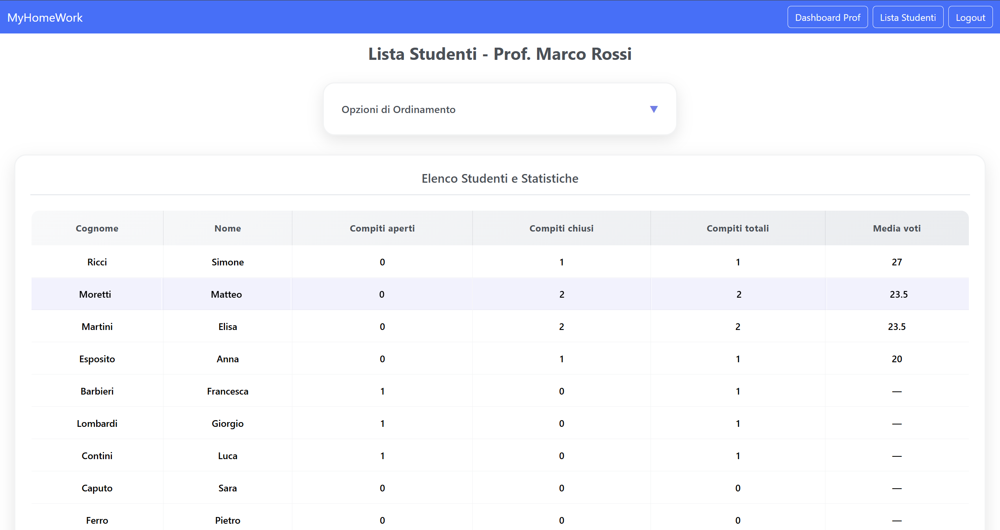
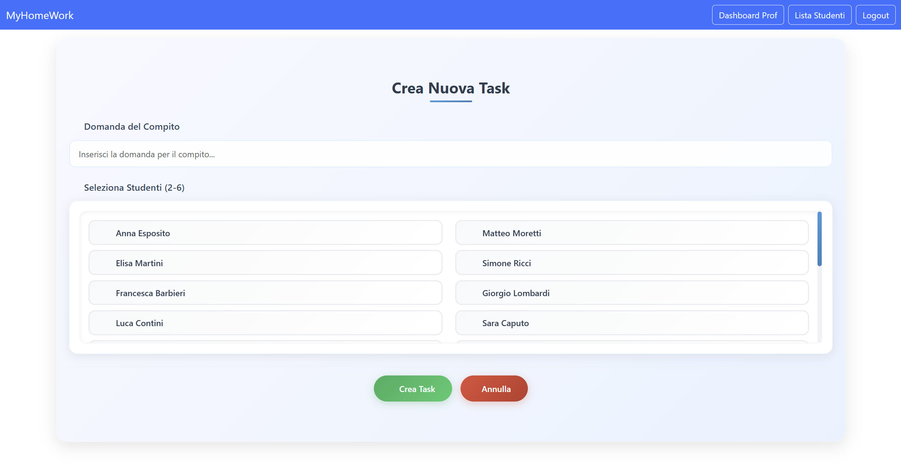

# Exam #2: "Compiti"
## Student:  Fabrizi Francesco 

## React Client Application Routes

- Route `/`: Homepage, è la pagina iniziale dove è possibile fare il login. Questa pagina sarà disponibile solo se non si è loggati.
- Route `/professore`: Home dedicata al professore, da qui il professore può visualizzare tutte le sue task assegnate, può vedere i dettagli e assegnare voti se sono presenti compiti da valutare.
- Route `/professore/listaStudenti`: Il professore può avere una panoramica sugli studenti (media rispetto ai suoi task) e ordinarli in base ad alcuni criteri.
- Route `/professore/task/:id/domanda`: Il professore può vedere i dettagli del task (domanda, componenti del gruppo, risposta alla domanda) e, se possibile, può mettere un voto.
- Route `/professore/task/new`: Form in cui il professore può creare una nuova task.
- Route `/studente`: Homepage per lo studente, in questa pagina lo studente visualizza le sue informazioni tra cui la media totale (la media di tutti i voti indipendentemente dal professore), vede le sue task (aperte e chiuse) può procedere nel modificare una risposta o visualizzare il voto.
- Route `/studente/task/:id/domanda`: Può avere più dettagli sulla domanda, visualizzare il voto se presente e se la Task non è ancora chiusa può modificare la risposta.
- Route `/login`: Pagina del login dove è possibile tramite le credenziali autenticarsi e avere accesso alle funzionalità disponibili.
- Route `*`: Not Found page, se l'utente va in route non presenti viene mandato nella Not Found page.

## API Server

Tutte le API del Server sono utilizzabili esclusivamente da utenti autenticati

### Authentication

- POST `/api/sessions`
  - Description: utile per autenticare un utente tramite username e password
  - Request body: JSON object con le credenziali dell'utente:
    ```
    {
      "username": "rossi.marco",
      "password": "passwordprof"
    }
    ```
  - Response: le possibili risposte sono:
    - `201 Created`: in caso di successo.
    - `401 Unauthorized`: in caso di credenziali errate.
  - Response body: un oggetto contenente alcune informazioni dell'utente, in caso di successo:
    ```
    {
      "id": 1,
      "username": "rossi.marco",
      "nome": "Marco",
      "ruolo": "insegnante",
      "cognome": "Rossi"
    }
    ```
- GET `/api/sessions/current`
  - Description: restituisce le informazioni dell'utente autenticato nella sessione corrente
  - Response: le possibili risposte sono:
    - `200 OK`: in caso di successo.
    - `401 Unauthorized`: se l'utente non è autenticato.
  - Response body: oggetto JSON con le informazioni dell'utente, in caso di successo:
    ```
    {
      "id": 1,
      "username": "rossi.marco",
      "nome": "Marco",
      "ruolo": "insegnante",
      "cognome": "Rossi"
    }
    ```
- DELETE `/api/sessions/current`
  - Description: elimina la sessione corrente ed effettua il logout dell'utente
  - Response: le possibili risposte sono:
    - `200 OK`: in caso di successo.

### Studenti

  - GET `/api/students`

    - Description: restituisce la lista di tutti gli studenti (solo per professori autenticati)
    - Response: le possibili risposte sono:
        - `200 OK`: in caso di successo.
        - `403 Forbidden`: se non sei un professore autenticato.
        - `500 Internal Server Error`: generic error
    - Response body: array di studenti
        ```
          [
            {
              "id": 3,
              "username": "esposito.anna",
              "ruolo": "studente",
              "nome": "Anna",
              "cognome": "Esposito"
            },
            ...
          ]
        ```

  - GET `/api/students/:id`
    - Description: restituisce le informazioni sullo studente
    - Response: le possibili risposte sono:
        - `500 Internal Server Error`: generic error
        - `200 OK`: in caso di successo.
        - `404 Not Found`: se non esiste lo studente con l'id specificato
        - `403 Forbidden`: se non sei autenticato
    - Response body: JSON con le informazioni dello studente:
        ```
        {
          "id": 3,
          "username": "esposito.anna",
          "ruolo": "studente",
          "nome": "Anna",
          "cognome": "Esposito"
        }
        ```
### Task

  - GET `/api/tasks/:id`
    - Description: restituisce la task con lo specifico id
    - Response: le possibili risposte sono:
        - `500 Internal Server Error`: generic error
        - `200 OK`: in caso di successo.
        - `404 Not Found`: se la task non esiste
        - `403 Forbidden`: se non sei autenticato, se non sei il professore proprietario della task o se non fai parte del gruppo assegnato alla task
    - Response body: restituisce le informazioni sulle task specifica:
        ```
        {
          "id": 1,
          "domanda": "Qual è la capitale della Francia?",
          "id_prof": 1,
          "stato": "chiuso",
          "risposta": "Parigi",
          "voto": 20,
          "dimensione_gruppo": 3
        }
        ```


  - GET `/api/tasks/professor/:id`
    - Description: restituisce tutte le task del professore con l'id specificato
    - Response: le possibili risposte sono:
        - `500 Internal Server Error`: generic error
        - `200 OK`: in caso di successo.
        - `403 Forbidden`: se non sei autenticato, se non sei un professore e  se la task non e' del professore stesso
    - Response body: array con le informazioni sulle task:
        ```
        [
        {
          "id": 1,
          "domanda": "Qual è la capitale della Francia?",
          "id_prof": 1,
          "stato": "chiuso",
          "risposta": "Parigi",
          "voto": 20,
          "dimensione_gruppo": 3
        },
        ...
        ]
        ```

  - GET `/api/tasks/student/:id`
    - Description: restituisce tutte le task dello studente con l'id specificato
    - Response: le possibili risposte sono:
        - `500 Internal Server Error`: generic error
        - `200 OK`: in caso di successo.
        - `403 Forbidden`: se non sei autenticato, se non sei uno studente, se non sei lo studente stesso
    - Response body: array con le informazioni sulle task:
        ```
        [
          {
            "id": 1,
            "domanda": "Qual è la capitale della Francia?",
            "id_prof": 1,
            "stato": "chiuso",
            "risposta": "Parigi",
            "voto": 20,
            "dimensione_gruppo": 3
          },
          {
            "id": 5,
            "domanda": "Chi è stato il primo uomo sulla Luna?",
            "id_prof": 2,
            "stato": "chiuso",
            "risposta": "Neil Armstrong.",
            "voto": 30,
            "dimensione_gruppo": 3
          },
          ...
        ]
        ```
  
  - POST `/api/tasks`
    - Description: Crea una nuova task, solo i professori possono creare nuove task.
    - Request body: JSON con i dati della nuova task e la lista degli studenti che compongono il gruppo:
      ```
      {
        "domanda": "Qual è la capitale della Francia?",
        "id_prof": 1,
        "dimensione_gruppo": 3,
        "studenti": [3, 4, 5]
      }
      ```
    - Response: le possibili risposte sono:
        - `201 Created`: in caso di successo, restituisce la task creata.
        - `400 Bad Request`: dati non validi, gruppo non valido, o regole di gruppo violate (alcuni studenti hanno collaborato già più di 2 volte).
        - `403 Forbidden`: se non sei autenticato come professore o stai cercando di creare una task per un altro professore.
        - `500 Internal Server Error`: errore generico del server.
    - Response body: oggetto JSON con l'id della task creata:

      ```
      {
        "id": 9
      }
      ```

  - PUT `/api/tasks/:id/vote`
    - Description: Assegna un voto a una task e la task viene chiusa. Solo il professore proprietario può votare, e solo se la task è aperta e ha una risposta.
    - Request body:
      ```
      {
        "voto": 28
      }

      ```
    - Response: possibili risposte:
      - `200 OK`: voto assegnato con successo.
      - `400 Bad Request`: voto non valido, task chiusa o senza risposta.
      - `403 Forbidden`: se non sei il professore proprietario.
      - `404 Not Found`: se la task non esiste.
    - Response body: restituisce un messaggio di successo

      ```
      {
        "message": "Task chiuso con successo."
      }

      ```

  - PUT `/api/tasks/:id/risposta`
      - Description: Permette allo studente di rispondere a una task. Solo se fa parte del gruppo e la task è aperta.
      - Request body:
        ```
        {
          "risposta": "La mia risposta alla domanda"
        }
        ```
      - Response: possibili risposte:
        - `200 OK`: risposta salvata con successo.
        - `400 Bad Request`: risposta vuota o task chiusa.
        - `403 Forbidden`: se non fai parte del gruppo o sei un professore.
        - `404 Not Found`: se la task non esiste.
      - Response body: restituisce un messaggio di successo:
        ```
          {
            "message": "Risposta al task aggiornata con successo."
          }

        ```
### Gruppi 

  - GET `/api/groups/tasklist/:id`
    - Description: restituisce i membri del gruppo appartenente a quella task con l'id specificato
    - Response: le possibili risposte sono:
        - `500 Internal Server Error`: generic error
        - `200 OK`: in caso di successo.
        - `404 Not Found`: nel caso non esista la task
        - `403 Forbidden`: se non sei autenticato, se la task non è del professore che la richiede o lo studente non appartiene al gruppo a cui è stata assegnata la task
    - Response body: Array che contiene gli id degli studenti che fanno parte del gruppo assegnato alla task specifica:

        ```
        [
          3,
          4,
          5
        ]
        ```
  - GET `/api/groups/verify`
    - Description: Verifica se una coppia di studenti ha già collaborato almeno due volte in gruppi creati dallo stesso professore
    - Query parameters:
        - `id_prof` (numero, obbligatorio): ID del professore che effettua la verifica.
        - `id_studente1` (numero, obbligatorio): ID del primo studente.
        - `id_studente2` (numero, obbligatorio): ID del secondo studente.
    - Response: le possibili risposte sono:
        - `500 Internal Server Error`: generic error
        - `200 OK`: in caso di successo.
        - `403 Forbidden`: se non sei autenticato, se la task non e' del professore che la richiede
    - Response body: restituisce true o false in base al fatto se due studenti sono già stati insieme almeno 2 volte per lo stesso professore

        ```
        true

        ```

  - POST `/api/groups`
    - Description: Crea un nuovo gruppo per una task esistente. Solo i professori possono farlo.
    - Request body: JSON con l'id del task e la lista degli studenti che compongono il gruppo:
      ```
      {
        "id_task": 8,
        "id_studenti": [3, 4, 5]
      }

      ```
    - Response: possibili risposte:
      - `201 Created`: gruppo creato con successo.
      - `400 Bad Request`: dati non validi, gruppo già esistente o studenti che hanno già collaborato insieme almeno 2 volte.
      - `403 Forbidden`: se non sei il professore proprietario del task o se sei uno studente.
      - `404 Not Found`: se il task non esiste.
    - Response body: array con l'id delle coppie id_task, id_studente:
      ```
      [
        {
          "id": 23
        },
        {
          "id": 24
        }
      ]
          

      ```


## Database Tables

- Table `Utenti` - contiene id, username, pass, salt, ruolo, nome, cognome
- Table `Task` - contiene id, domanda, id_prof, stato, risposta, voto, dimensione_gruppo
- Table `Gruppi` - contiene  id_task, id_studente

## Main React Components

- `Home` (in `home.jsx`): pagina principale, visibile agli utenti non autenticati, contiene il bottone per il login.
- `UtenteHome` (in `UtenteHome.jsx`): componente principale che in base all'utente autenticato (professore o studente), mostra alcune statistiche e i compiti ricevuti o assegnati. Inoltre sono presenti i pulsanti tramite cui è possibile gestire i task o inserirne di nuovi se si hanno i permessi.
- `StudentiTable` (in `ProfListStud.jsx`): pagina in cui il professore può visualizzare una tabella contenente le informazioni degli studenti, StudentiTable realizza la tabella con le informazioni che possono essere poi ordinate in base ad alcuni criteri.
- `Domanda` (in `Domanda.jsx`): pagina dettagliata di una task: mostra la domanda, risposta e altre informazioni e tramite form è possibile in alcuni casi inserire il voto o modificare la risposta.
- `TaskForm` (in `TaskForm.jsx`): Form per la creazione di una nuova task (compito) da parte del professore. Gestisce la selezione degli studenti e la validazione.
- `LoginForm` (in `login.jsx`): gestisce il login tramite form.


## Screenshot







## Users Credentials

### Professori
- rossi.marco, passwordprof (2 task chiuse e 1 aperta)
- bianchi.lucia, passwordprof (1 task chiusa e 2 aperte)

### Studenti
Per tutti lo username è cognome.nome e la password è passwordstud.
moretti.matteo e martini.elisa sono stati già insieme in due gruppi per il prof rossi.marco.

- esposito.anna, passwordstud 
- moretti.matteo, passwordstud 
- martini.elisa, passwordstud
- ricci.simone, passwordstud 
- barbieri.francesca, passwordstud
- lombardi.giorgio, passwordstud
- contini.luca, passwordstud
- caputo.sara, passwordstud
- ferro.pietro, passwordstud
- bianchi.marta, passwordstud
- verdi.anna, passwordstud
- neri.matteo, passwordstud
- gialli.elisa, passwordstud
- blu.simone, passwordstud
- viola.francesca, passwordstud
- marrone.giorgio, passwordstud
- rosa.luca, passwordstud
- grigi.sara, passwordstud
- ferri.clara, passwordstud
- greco.nicolo, passwordstud


# WebApp

